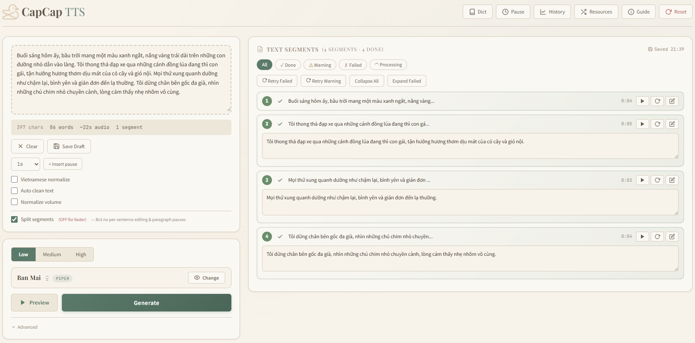

# CapCap TTS — Vietnamese Text-to-Speech

> **100% Free · 100% Local · No API Keys · No Cloud · No Limits**

A self-hosted Vietnamese Text-to-Speech tool that runs entirely on your machine. No subscriptions, no usage quotas, no data sent to external servers. Your text and audio never leave your computer.



## Why Local & Free?

| | Cloud TTS (Google, Azure, etc.) | CapCap TTS |
|---|---|---|
| **Cost** | Pay per character / minute | **Free forever** |
| **Privacy** | Text sent to external servers | **100% local, offline** |
| **Limits** | Rate limits, quotas, API keys | **Unlimited, no keys needed** |
| **Internet** | Required | **Not required** |
| **Voice Cloning** | Expensive or unavailable | **Free with F5-TTS** |

## Features

- **Vietnamese-first** — Optimized for Vietnamese text normalization and pronunciation
- **3 Quality Tiers** — Choose based on your hardware and quality needs:
  - **Low (Piper)** — Fast, lightweight, CPU-friendly
  - **Medium (F5-TTS)** — High-quality zero-shot voice cloning, GPU recommended
  - **High (OmniVoice)** — Best quality, HuggingFace model, GPU required
- **Shared voice library** — F5 and OmniVoice share the same reference audio & text
- **Chunk-based generation** — Long text split into segments, generated with progress tracking
- **Multiple split modes** — Split by sentence, paragraph, or both (default)
- **Per-segment voice selection** — Assign different voices to individual segments
- **Segment quality check** — Auto-detects incomplete speech, low volume, excessive silence, clipping
- **Segment download** — Download individual segments (WAV), all segments as ZIP, or merged audio (MP3/WAV/SRT)
- **Voice cloning** — Clone voices with name, gender & description; auto-saved to shared `voices.json`
- **Voice management** — Browse, filter by gender/type (clone/default), edit description, delete cloned voices
- **File queue** — Drag & drop multiple `.txt` files, batch process with per-file config (voice, split mode, speed)
- **Auto-merge** — Multi-segment results automatically merged after generation
- **Segment quality check** — Auto-detects incomplete speech, low volume, excessive silence, clipping
- **Dark mode** — Toggle in header, persists across sessions
- **Custom dictionary** — Override pronunciation for acronyms and non-Vietnamese words
- **Pause control** — Adjustable silence after punctuation + custom `[Xs]` markers
- **History** — Auto-saved generation history with playback
- **Vietnamese normalization** — Built-in text normalization via `vietnormalizer`
- **Advanced audio player** — Waveform visualization, real-time seek, ±2s skip, speed control, volume slider, drag seek

## Segment Quality Check

After each audio segment is generated, CapCap automatically evaluates its quality and classifies it:

| Status | Meaning | Can Export | Icon |
|--------|---------|-----------|------|
| **done** | Audio is usable, no quality issues | ✅ | Green checkmark |
| **warning** | Playable but has issues (short duration, low volume, clipping, excessive silence) | ✅ | Yellow warning triangle |
| **failed** | Audio corrupted, silent, or too short for the input text | ❌ | Red error icon |

**What triggers a warning:**
- Duration too short/long vs. expected (based on text length)
- Silence ratio ≥ 45% 
- Leading silence ≥ 1s or trailing silence ≥ 1.5s
- RMS < -35dB or peak < -18dB (low volume)
- Clipping ratio ≥ 0.1%
- Text > 500 characters per segment

**What triggers a failed status:**
- Generation error
- Missing or empty audio file
- Corrupted audio (decode failure)
- Zero duration
- Silence ratio ≥ 98% (full silence)
- Text ≥ 30 chars but audio < 0.5s

Failed segments block the Merge & Download action. Warning segments can still be exported.

You can click **Download** on any individual segment (always WAV format, lossless).

## Batch Processing

Drag & drop multiple `.txt` files onto the input area to add them to the processing queue:

- **Per-file config** — Click a file to edit its settings (voice, split mode, speed, etc.) in the main UI
- **Save button** — Save current UI settings as that file's configuration (shows ✓ when saved)
- **Apply to all** — Copy current UI settings to all pending files at once
- **Process All** — Process all pending files sequentially with their individual configs
- **Results** — Click completed files to view segments and play merged audio
- **Limits** — Max 20 files, empty files are automatically rejected

Each file's audio output is auto-merged (for split mode) and stored in the backend's `outputs/` directory.

## Hardware Recommendation

| Setup | Recommended Version | Notes |
|-------|---------------------|-------|
| **GPU (NVIDIA 4GB+)** | `backend/` (GPU version) | All 3 tiers available. OmniVoice needs 4GB+ VRAM. |
| **GPU (NVIDIA 6GB+)** | `backend/` (GPU version) | Recommended for OmniVoice (High quality). |
| **CPU only** | `backend_cpu/` (CPU version) | Low tier (Piper) only. Lightweight and fast. |
| **Mac / AMD** | `backend_cpu/` (CPU version) | F5-TTS and OmniVoice optimized for NVIDIA GPUs. |

### Quality Tiers

| Tier | Engine | Speed | Quality | GPU Required |
|------|--------|-------|---------|-------------|
| **Low** | Piper | ⚡⚡ Fast | Good | No |
| **Medium** | F5-TTS | ⚡⚡ Medium | Very Good | Yes (4GB+) |
| **High** | OmniVoice | ⚡ Slow | Best | Yes (6GB+) |

> **Recommendation:** Use the **GPU version** if you have an NVIDIA GPU. OmniVoice (High) gives the best quality but is slower. Piper (Low) runs on any machine.

## Prerequisites

### 1. Python 3.11+

Download from [python.org](https://www.python.org/downloads/). Verify installation:
```bash
python --version
```

### 2. FFmpeg (Required)

FFmpeg is used for audio conversion (WAV ↔ MP3). **Must be installed separately.**

**Windows:**
1. Download FFmpeg from [gyan.dev](https://www.gyan.dev/ffmpeg/builds/) (get the "essentials" build)
2. Extract to a folder (e.g., `D:\ffmpeg`)
3. Set the path in `config.py` or via environment variable:
   ```python
   FFMPEG_DIR = Path(r"D:\ffmpeg\bin")
   ```
4. Verify:
   ```cmd
   D:\ffmpeg\bin\ffmpeg.exe -version
   ```

**Linux:**
```bash
sudo apt install ffmpeg   # Debian/Ubuntu
sudo dnf install ffmpeg   # Fedora
```

**macOS:**
```bash
brew install ffmpeg
```

### 3. Model Files (Download Separately)

The project does not include model weights. Download and place them according to `config.py`:

| Folder | Contents | Download |
|--------|----------|----------|
| `PIPER_DIR` | Piper `.onnx` voice models + `.onnx.json` configs | [Hugging face]([https://huggingface.co/Hacht/CapCapResource](https://huggingface.co/Hacht/CapCapResource/tree/main/piper)) |
| `F5_MODEL_DIR` | F5-TTS checkpoint (`model_last_repo_compatible_weights.pt`) + `vocab.txt` | [Hugging face](https://huggingface.co/Hacht/CapCapResource) |
| `F5_VOCODER_DIR` | Vocos vocoder (`vocos-mel-24khz`) | Bundled with F5-TTS |
| `F5_VOICES_DIR` | Reference audio (`.wav`/`.mp3`) + `voices.json` for F5 + OmniVoice voices | [OmniVoice voices.json](https://huggingface.co/Hacht/omnivoice-vietnamese) |
| `F5_VOICES_DIR` | Your own cloned voice recordings | Your own recordings |

> **Note:** F5-TTS and OmniVoice **share the same voice directory**. The `voices.json` file defines available voices with reference audio and text. Both engines read from this shared pool.

### 4. GPU Version Only — CUDA

If using the GPU version with F5-TTS:
- NVIDIA GPU with **4GB+ VRAM**
- [CUDA Toolkit](https://developer.nvidia.com/cuda-toolkit) 11.8+
- PyTorch with CUDA support:
  ```bash
  pip install torch torchaudio --index-url https://download.pytorch.org/whl/cu118
  ```

## Quick Start

### GPU Version (Piper + F5-TTS)

```bash
cd backend
pip install -r requirements.txt
python main.py
```

Or double-click `run_api.bat`

### CPU-Only Version (Piper only)

```bash
cd backend_cpu
pip install -r requirements.txt
python main.py
```

Or double-click `run_api_cpu.bat`

Open http://localhost:8000 in your browser.

## Configuration

### Path Configuration

Edit `config.py` (or `backend_cpu/config.py`) to point to your installed resources:

```python
# Required — must exist
PIPER_DIR = Path(r"D:\TTS_Resource\piper")          # Piper .onnx models
FFMPEG_DIR = Path(r"D:\ffmpeg\bin")                  # ffmpeg.exe + ffprobe.exe

# GPU version only
F5_RESOURCE_DIR = Path(r"D:\TTS_Resource\f5")        # F5-TTS checkpoint + vocoder
```

Or set via environment variables:
```bash
set PIPER_DIR=D:\TTS_Resource\piper
set FFMPEG_DIR=D:\ffmpeg\bin
```

### Verify FFmpeg

Before running, make sure ffmpeg is accessible:
```bash
python -c "from pydub import AudioSegment; AudioSegment.from_wav('/dev/null')" 2>&1 | grep -i ffmpeg
```

If you see a warning about ffmpeg not found, update `FFMPEG_DIR` in `config.py`.

### Network Access

By default the server binds to `0.0.0.0` — accessible from your local network.

To restrict to localhost only, change `host="0.0.0.0"` to `host="127.0.0.1"` in `main.py` and `run_api.bat`.

To allow LAN access on Windows, open the firewall port:
```cmd
netsh advfirewall firewall add rule name="TTS API Port 8000" dir=in action=allow protocol=TCP localport=8000
```

Others on your Wi-Fi can then access via `http://<your-ip>:8000`

## Project Structure

```
TTS/
├── backend/              # GPU version (Piper + F5-TTS + OmniVoice)
│   ├── main.py           # FastAPI endpoints (download, clone, voice CRUD)
│   ├── tts_quality_checker.py  # Segment quality evaluation module
│   ├── tts_engine.py     # PiperEngine, F5Engine, OmniVoiceEngine, TaskManager
│   ├── config.py         # Path configuration
│   ├── requirements.txt  # Dependencies
│   ├── custom_dict/      # User dictionaries (CSV)
│   ├── outputs/          # Generated audio files
│   └── f5_tts/           # Local F5-TTS copy
├── backend_cpu/          # CPU-only version (Piper only)
│   ├── main.py
│   ├── tts_quality_checker.py
│   ├── tts_engine.py
│   ├── config.py
│   ├── requirements.txt
│   └── custom_dict/
├── frontend/
│   ├── index.html        # Single-page UI
│   ├── capcap.svg        # Logo
│   └── jszip.min.js      # ZIP export library
├── run_api.bat           # Launch GPU version
├── run_api_cpu.bat       # Launch CPU version
├── screenshot.png        # UI screenshot
└── README.md
```

## API Endpoints

| Method | Endpoint | Description |
|--------|----------|-------------|
| `GET` | `/tts/voices` | List voices with `gender`, `description`, `is_clone` |
| `POST` | `/tts/preview` | Generate short preview |
| `POST` | `/tts/generate` | Start generation (supports `split_mode`: default/sentence/paragraph) |
| `GET` | `/tts/status/{task_id}` | Progress + per-segment quality (`issues[]`, `can_export`, `warning`) |
| `POST` | `/tts/merge` | Merge segments → final MP3/WAV + SRT |
| `POST` | `/tts/regenerate_chunk` | Regenerate a segment (with optional per-segment `voice_id`) |
| `GET` | `/tts/download_file` | Download audio (128k/320k MP3, WAV, or SRT) |
| `POST` | `/tts/clone` | Clone a voice (accepts `gender`, `description`) |
| `DELETE` | `/tts/voices/{voice_id}` | Delete a cloned voice |
| `PATCH` | `/tts/voices/{voice_id}` | Update voice description/gender |
| `GET/POST/DELETE` | `/tts/dict/acronyms` | Acronym dictionary |
| `GET/POST/DELETE` | `/tts/dict/words` | Word dictionary |
| `GET/POST` | `/tts/pause_config` | Pause configuration |
| `GET/DELETE` | `/tts/history` | Generation history |

## Dependencies

### GPU Version
- `fastapi`, `uvicorn` — Web framework
- `pydub`, `ffmpeg` — Audio processing
- `torch`, `torchaudio` — PyTorch (GPU)
- `f5-tts` — Voice cloning model (Medium tier)
- `omnivoice`, `soundfile` — OmniVoice model (High tier)
- `piper-tts`, `onnxruntime` — Fast TTS (Low tier)
- `librosa`, `numpy` — Audio effects (pitch shift)
- `vietnormalizer` — Vietnamese text normalization
- `omegaconf` — Config management

### CPU Version
- `fastapi`, `uvicorn`
- `pydub`, `ffmpeg`
- `piper-tts`, `onnxruntime`
- `vietnormalizer`
- `numpy`

## License

Apache License 2.0. See [LICENSE](./LICENSE).

## References

This project builds on and references the following open-source projects:

- [OmniVoice Vietnamese](https://huggingface.co/Hacht/omnivoice-vietnamese) — High-quality Vietnamese TTS (High tier)
- [F5-TTS-Vietnamese](https://github.com/nguyenthienhy/F5-TTS-Vietnamese) — Vietnamese voice cloning (Medium tier)
- [vietnormalizer](https://github.com/nghimestudio/vietnormalizer) — Vietnamese text normalization
- [piper](https://github.com/rhasspy/piper) — Local text-to-speech synthesis (Low tier)
